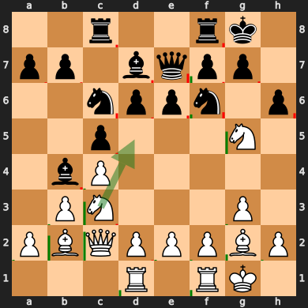
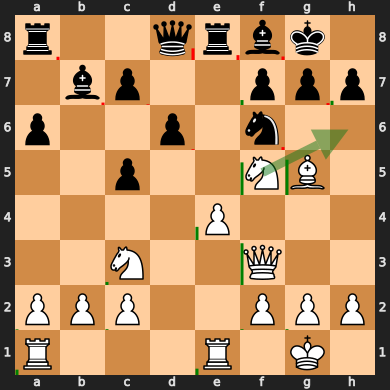
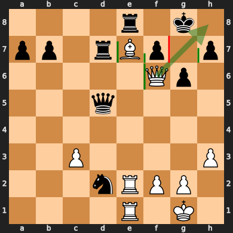

# PVCFA: Principal Variation Context Feature Attribution
## Distributed Chess for Perturbation-based Saliency Maps

### Abstract
The research and development field of computer chess improved more in the last 5 years than in the whole history of computers. Unfortunately these unprecedented results comes with techniques that don't leave much space to intuition and comprehensibility for humans. Moreover, even though chess engines reached an almost perfect chess playing style, it is still debatable whether to define it intelligent or not. Indeed, what does "intelligence" mean when it comes to playing chess? The human reasoning logics over this game are surely fascinating and still to be completely discovered. Understanding the processes of feature extraction that runs in a human brain when queried with a chessboard can lead to develop not only better chess engines, but also new techniques in the field of Artificial Intelligence. This research attempts to develop a method of feature extraction based on the generation of saliency maps that should be promoting comprehensibility of the chessboard state, as well as setting the foundation for a possible Multiagent interpretation of the game of chess. The proposed method, PVCFA, can be considered an answer to the [SARFA](https://github.com/nikaashpuri/sarfa-saliency) method, that currently represent the state-of-the-art of saliency maps generation for chess. The results PVCFA provides are objectively carrying more information than [SARFA](https://github.com/nikaashpuri/sarfa-saliency), as the representation displays how the pieces are involved not only in the current move, but in the whole action. PVCFA does so by executing a perturbative actionless exploration along a selected moves line; exploration process that is proved mathematically faster than [SARFA](https://github.com/nikaashpuri/sarfa-saliency). The utilization of perturbation methods can be essential to unlock new tree exploration techniques based on cognition of the context and less on brute-force or generic heuristics.

## Result examples

